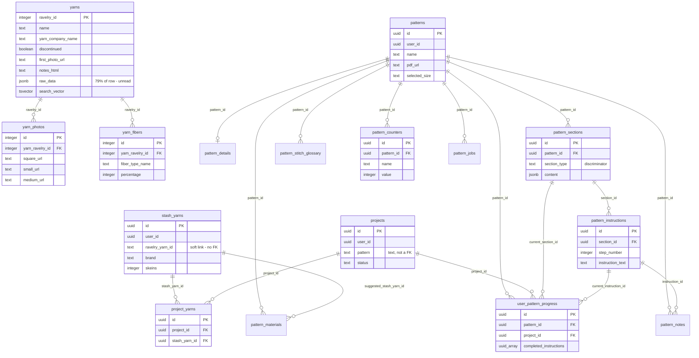

# Database usage audit

_Measured 2026-08-16 against the hosted project `girphalmeqpiagkcimhu`, via the
service-role key over PostgREST._

## TL;DR

Three catalog tables hold **99.97% of every row in the database**. One column —
`yarns.raw_data` — is on its own about **57% of the entire database's logical
content**, and the application never reads it. The user-facing half of the app
(patterns, stash, projects) totals **163 rows**.

If the limit being hit is database size, the cause is the Ravelry catalog
import, and specifically `raw_data`. If it's egress, the cause is
`/api/yarns` joining `yarn_photos` into every list response for data that is
never rendered.

## What was measured

Row counts are exact (`Prefer: count=exact`). Byte figures are **JSON payload
size**, sampled — not on-disk size. See [Getting exact numbers](#getting-exact-numbers)
for the SQL that reports true disk usage; I have no SQL access from here, and no
RPCs are exposed on this project.

| Table | Rows | Avg row | Est. JSON total |
|---|---:|---:|---:|
| `yarns` | 98,091 | 6,068 B | **~568 MB** |
| `yarn_photos` | 275,395 | 746 B | ~196 MB |
| `yarn_fibers` | 177,644 | 142 B | ~24 MB |
| `pattern_instructions` | 100 | 680 B | 0.1 MB |
| `pattern_sections` | 28 | 480 B | ~0 |
| `pattern_stitch_glossary` | 16 | 345 B | ~0 |
| `pattern_materials` | 7 | 383 B | ~0 |
| `stash_yarns` | 4 | 596 B | ~0 |
| `patterns` | 3 | 596 B | ~0 |
| `pattern_jobs` | 3 | 636 B | ~0 |
| `pattern_details` | 2 | 19,566 B | ~0 |
| `pattern_counters`, `pattern_notes`, `projects`, `project_yarns`, `user_pattern_progress` | 0 | — | — |
| **Total** | **551,293** | | **~788 MB** |

`yarns` was sampled at 2,000 rows spread evenly across the table, because row
size varies a lot; the other tables were sampled at 20 rows, which is fine for
their far more uniform shapes.

**Storage buckets are not the problem.** `pattern-pdfs` holds 3 objects
totalling under 0.1 MB.

### Inside the `yarns` row

| Column | Avg bytes | Share of row |
|---|---:|---:|
| `raw_data` (jsonb) | 4,777 B | **78.7%** |
| `notes_html` | 173 B | 2.9% |
| everything else (37 columns) | ~1,118 B | 18.4% |

Projected across 98,091 rows: `raw_data` is **~447 MB** of JSON. Without it,
`yarns` would be roughly **121 MB**.

`raw_data` holds the complete Ravelry API response for every yarn. It is
written once by `scripts/import-yarns.ts:214` and **read by nothing** — the app
selects around it (`app/api/yarns/route.ts:21`, "Select everything except
raw_data"), and `scripts/generate-seed.ts:55` documents it as "the full Ravelry
payload — never read by the app", emptying it in generated seed data.

### Dead weight beyond `raw_data`

- **30,108 of 98,091 yarns are discontinued** (30.7%). Every catalog query the
  app makes filters `discontinued=false`, so those rows — and their photo and
  fiber children — are never returned to anyone.
- **`yarn_photos` is never rendered.** It carries six URL columns per row
  (`square_url`, `small_url`, `small2_url`, `medium_url`, `medium2_url`,
  `shelved_url`) across 275,395 rows. The UI reads only `yarns.first_photo_url`,
  which is already denormalised onto the yarn row — `catalogYarnToYarn()` in
  `lib/types/yarn.ts:187` maps `first_photo_url` and nothing else. There is no
  yarn detail page; `app/yarns/` contains only `page.tsx`, the list.

## Egress: the wasted join

`/api/yarns` selects `..., yarn_fibers(*), yarn_photos(*)`
(`app/api/yarns/route.ts:24`). Measured against the live database, one
24-yarn page:

| Select | Response | Time | Per yarn |
|---|---:|---:|---:|
| current (columns + fibers + photos) | 126.9 KB | 584 ms | 5.3 KB |
| without the `yarn_photos` join | 40.6 KB | 201 ms | 1.7 KB |
| without photos or fibers | 36.2 KB | 192 ms | 1.5 KB |
| only the fields the card renders | 8.1 KB | 160 ms | 0.3 KB |

Dropping the photos join alone makes the response **3.1× smaller and ~2.9×
faster**. Sending only rendered fields makes it **15.6× smaller**. Paging the
whole live catalog costs ~351 MB today versus ~22 MB slimmed.

The brand index (`lib/yarns/brand-index.ts`) is **not** an egress problem — it
selects the single `yarn_company_name` column, ~68 requests of 1,000 rows, so
about 3 MB per build, cached 6 hours per server instance.

## Schema



### The three zones

The schema splits into three groups that barely touch each other. That
separation is why the size problem is so lopsided: the whole of zone 1 is
machine-generated reference data, and zones 2 and 3 are the actual product.

**1. Global catalog** — `yarns`, `yarn_photos`, `yarn_fibers`. Read-only for
authenticated users, populated by `scripts/import-yarns.ts` from Ravelry. This
is 551,130 of the database's 551,293 rows.

**2. Stash and projects** — `stash_yarns`, `projects`, `project_yarns`.

**3. Patterns** — `patterns` plus nine child tables, built by the PDF
extraction pipeline.

### Every connection, in words

**Catalog internals.** `yarns` is keyed on `ravelry_id` (an integer from
Ravelry), not a surrogate `id`. Both `yarn_photos.yarn_ravelry_id` and
`yarn_fibers.yarn_ravelry_id` are real foreign keys to it. One yarn has many
photos (2.8 on average) and many fibers (1.8 on average).

**Catalog → stash is a soft link.** `stash_yarns.ravelry_yarn_id` is `text`
while `yarns.ravelry_id` is `integer`, and there is no foreign key between them.
A stash entry copies `brand`, `name`, `fiber_content` and `yardage` as plain
text rather than joining. This means the stash does not depend on the catalog:
trimming the catalog cannot orphan anyone's stash.

**Projects → stash.** `project_yarns` is the join table between a project and
the stash yarns assigned to it — `project_id` → `projects.id`,
`stash_yarn_id` → `stash_yarns.id`. It also denormalises `yarn_name` and
`colorway` and tracks `skeins_needed` versus `skeins_used`.

**Projects → patterns is also soft.** `projects.pattern` is a `text` column, not
a foreign key to `patterns.id`. A project names its pattern as a string.

**Pattern children.** All of these hang off `patterns.id`:

- `pattern_details` — one row per pattern: sizes, gauge, needles, notions.
- `pattern_materials` — the yarns the pattern calls for.
- `pattern_sections` — named, ordered chunks. `section_type` is a
  discriminator: `written_instructions` sections put their rows in
  `pattern_instructions`, while `chart`, `stitch_pattern`, `schematic` and
  `notes` sections store their payload in the `content` jsonb column.
- `pattern_instructions` — attaches to `pattern_sections.id`, **not** directly
  to `patterns.id`. It is the only pattern child that is a grandchild.
- `pattern_stitch_glossary` — per-pattern abbreviations.
- `pattern_notes` — a user note, optionally pinned to a specific instruction via
  `instruction_id`.
- `pattern_counters` — the stitch counters, scoped by `(user_id, pattern_id)`.
- `pattern_jobs` — extraction job status. Select-only to users; written by the
  worker through the service-role client.
- `user_pattern_progress` — where the knitter is.

**The one table that ties zones together.** `user_pattern_progress` points at a
pattern, a project (`project_id` → `projects.id`), and the exact section and
instruction currently in progress (`current_section_id`,
`current_instruction_id`). `pattern_materials.suggested_stash_yarn_id` →
`stash_yarns.id` is the other cross-zone edge, matching a pattern's required
yarn to something already in the stash.

**Ownership.** `user_id` on `stash_yarns`, `projects`, `patterns`,
`pattern_notes`, `pattern_counters`, `pattern_jobs` and `user_pattern_progress`
is a `uuid` referencing `auth.users`. PostgREST does not expose that as a
foreign key because it crosses schemas, but RLS enforces `auth.uid() = user_id`
on all of them. The deeper pattern children (`pattern_sections`,
`pattern_instructions`, `pattern_details`, `pattern_materials`,
`pattern_stitch_glossary`) have no `user_id` of their own and inherit ownership
through their parent pattern.

## What to cut

Ordered by payoff. Sizes are of the JSON payload; actual disk reclaimed depends
on TOAST compression and requires a table rewrite (see the caveat below).

| # | Action | Frees | Risk |
|---|---|---:|---|
| 1 | Drop or null `yarns.raw_data` | ~447 MB | Low — nothing reads it |
| 2 | Delete the 30,108 discontinued yarns (cascades to photos/fibers) | ~30% of the rest | Low — never shown |
| 3 | Trim `yarn_photos` to the URL sizes actually used, or drop the table | up to ~196 MB | Low — nothing renders it |
| 4 | Drop the `yarn_photos(*)` join from `/api/yarns` | 3.1× less egress, 2.9× faster | None |
| 5 | Narrow `/api/yarns/[id]`, which currently selects `*` including `raw_data` | ~6 KB/request | Low |

Items 4 and 5 are pure code changes with no data loss and are worth doing
regardless of which limit you're hitting.

**Recovery:** `raw_data` and the discontinued rows can be rebuilt by re-running
`npm run import:yarns`, so none of this is unrecoverable — but that re-import is
slow and hits the Ravelry API hard. Take a backup first.

### The disk-reclaim caveat

In Postgres, `ALTER TABLE ... DROP COLUMN` is metadata-only, and
`UPDATE ... SET raw_data = NULL` just creates dead tuples. **Neither shrinks the
database on its own.** You need a table rewrite:

```sql
VACUUM FULL yarns;   -- takes an ACCESS EXCLUSIVE lock; the table is unavailable meanwhile
```

This is also worth checking on its own. The importer upserts with
`ON CONFLICT ... DO UPDATE`, and every re-run of `npm run import:yarns` leaves a
dead tuple behind for each updated row. If the import has been run several
times, physical disk usage could be well above the live-data figures above,
purely from bloat — the `n_dead_tup` column in the query below will show it.

## Getting exact numbers

Run this in the SQL editor for true on-disk sizes, which will settle whether
it's the database or egress that's over:

```sql
select pg_size_pretty(pg_database_size(current_database())) as database_total;

select
  c.relname                                            as table,
  pg_size_pretty(pg_total_relation_size(c.oid))        as total,
  pg_size_pretty(pg_relation_size(c.oid))              as heap,
  pg_size_pretty(pg_indexes_size(c.oid))               as indexes,
  pg_size_pretty(coalesce(pg_total_relation_size(c.reltoastrelid), 0)) as toast,
  s.n_live_tup,
  s.n_dead_tup
from pg_class c
join pg_namespace n on n.oid = c.relnamespace
left join pg_stat_user_tables s on s.relid = c.oid
where n.nspname = 'public' and c.relkind = 'r'
order by pg_total_relation_size(c.oid) desc;
```

Expect `toast` to dominate on `yarns` — that is `raw_data` — and watch
`indexes`, since the GIN index over `search_vector` is likely the second-largest
single object.
