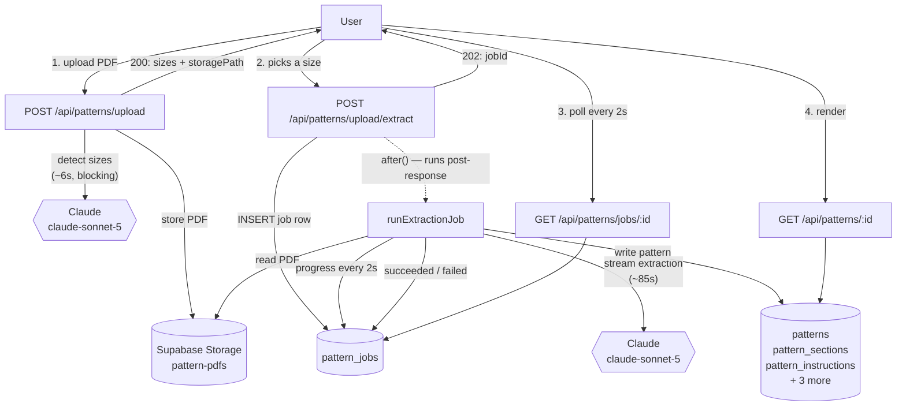
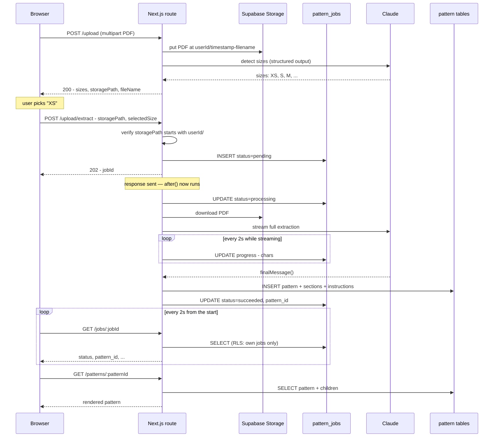
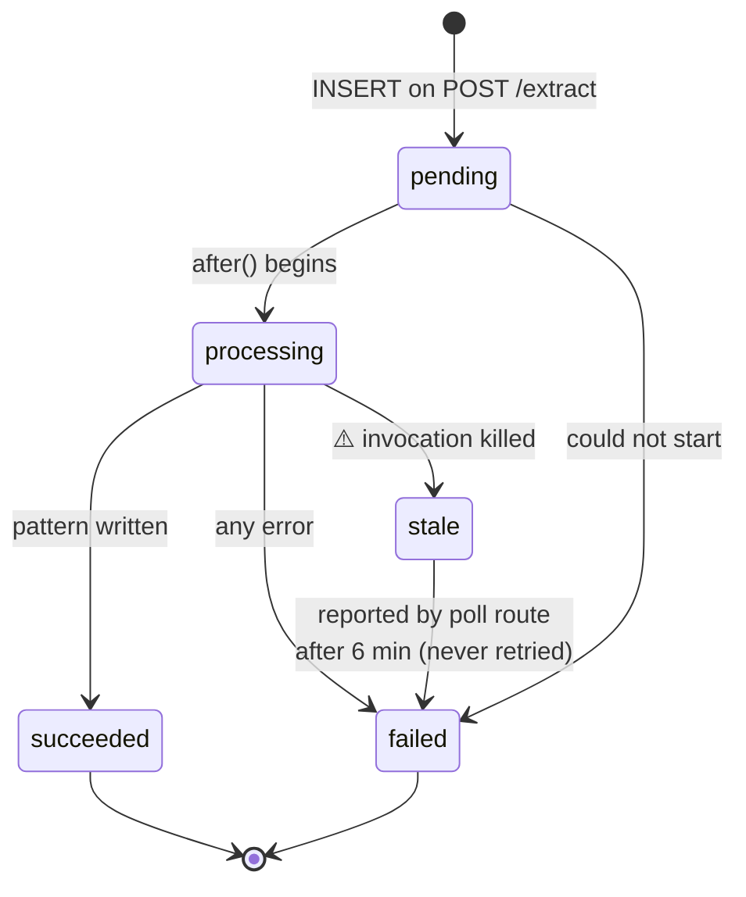

# Pattern Upload & Extraction

How a knitting pattern PDF becomes structured, renderable data.

> **Scope.** This describes the flow **as of PR #2** (background-job extraction).
> `main` today runs a simpler synchronous version — see
> [Before and after](#before-and-after) for the difference. Anything marked
> ⚠️ is a known limitation, not a description of intended behaviour.

---

## TL;DR

Upload is **two API calls, not one**, because the user picks a size in between.

1. **Phase 1** — PDF is stored, and Claude is asked *only* which sizes the pattern offers. Fast (~6s).
2. **The user picks a size.**
3. **Phase 2** — Claude extracts the full pattern, collapsed to that one size. Slow (~85s), so it runs in the background and the client polls.

Extraction is done entirely by Claude. There is no PDF text-extraction library in this project — the PDF bytes go straight to the model.

---

## Architecture



Two things to notice:

- **`after()` is not a queue.** It defers a callback until after the response is
  flushed, in the *same* serverless invocation. There is no broker and no
  worker pool.
- **Streaming stops at the backend.** The Claude call is streamed
  (backend ↔ Claude), but the browser learns about progress by *polling*.
  Nothing is streamed to the browser.

---

## Sequence — the happy path



---

## Job state machine



`stale` is not a stored value. If a row sits in `pending`/`processing` past
`STALE_AFTER_MS` (6 minutes), the poll route *reports* it as `failed` so the UI
can't spin forever. ⚠️ **The work is lost, not retried.**

---

## What gets written where

`pattern_jobs` holds **no pattern data** — it is purely bookkeeping, one row per
extraction attempt.

| Table | Holds |
|---|---|
| `pattern_jobs` | Job status, inputs, error, progress. The poll target. |
| `patterns` | The pattern itself — name, designer, `selected_size`, `pdf_url` |
| `pattern_details` | Gauge, needles, notions, finished measurements |
| `pattern_materials` | Yarn requirements |
| `pattern_sections` | Sections, discriminated on `section_type` |
| `pattern_instructions` | Rows for `written_instructions` sections |
| `pattern_stitch_glossary` | Abbreviations used by the pattern |

`pattern_sections.section_type` is polymorphic: `written_instructions` sections
store their rows in `pattern_instructions`; `chart`, `stitch_pattern`,
`schematic`, and `notes` store JSONB in `pattern_sections.content`.

⚠️ **The `patterns` row does not exist until extraction succeeds.** There is no
`status` column on `patterns` — status lives on the job. So there is no stable
pattern id to deep-link to while work is in flight.

---

## The Claude calls

Both phases use `claude-sonnet-5` with **thinking explicitly disabled**, because
thinking shares the `max_tokens` budget and neither call reads it.

| | Phase 1 (sizes) | Phase 2 (extraction) |
|---|---|---|
| `max_tokens` | 1,024 | 96,000 |
| Streamed | No | **Yes** |
| Output shape | `output_config` JSON schema | Prompt-constrained raw JSON |
| Typical duration | ~6s | ~85s |

Three constraints that are easy to reintroduce by accident:

1. **No assistant prefill.** Ending `messages` with
   `{role:'assistant', content:'{'}` returns **400** — current models reject it.
   Phase 1 uses structured outputs instead; phase 2 relies on its system prompt.
2. **Never index `content[0]`.** Find the text block by type. With thinking on,
   the first block is a thinking block.
3. **Pin the model in one place.** `claude-sonnet-4-20250514` was retired and
   started returning 404, which broke upload outright. Each route keeps the id
   in a single named constant.

### Size filtering is the whole point of phase 1

`buildExtractionPrompt(selectedSize)` injects an instruction telling Claude to
collapse multi-size notation down to the chosen size:

> Wherever the pattern lists values for multiple sizes — often in parenthetical
> format like `55 (56) 58 (59) 61 (62)` or comma-separated like
> `120 (132, 144, 156, 168)` — extract ONLY the value for size `XS`.

That is why upload is two calls. Without a size, every measurement in the
extracted pattern would be ambiguous.

---

## Failure modes

| Scenario | Behaviour |
|---|---|
| Not signed in | `401` |
| Not a PDF | `400` |
| `storagePath` not owned by caller | `403` |
| Job insert fails (table missing) | `500`, no `jobId` |
| Claude API error | Job → `failed`, message surfaced |
| Response hits `max_tokens` | Job → `failed` (**not** silently truncated) |
| Empty response | Job → `failed` |
| Invocation killed mid-run | Reported `failed` after 6 min. ⚠️ Not retried. |
| Extraction exceeds 300s | Killed by `maxDuration`. ⚠️ Not retried. |
| ⚠️ File too large | **No limit is enforced** — no `413` |

Ownership is checked **once**, in the extract route, because the background
worker uses the service-role key and bypasses RLS. That check is load-bearing.

---

## Known limitations

⚠️ These are real, current, and not addressed by PR #2:

1. **No retry.** `after()` gives no redelivery. Interrupted work is detected and
   reported, never re-run. A real queue would redeliver.
2. **300-second ceiling.** Extraction runs inside the request's `maxDuration`
   budget. A pattern needing longer is killed. Streaming protects against dying
   *early* from an idle connection; it does not raise this ceiling.
3. **`progress` is written but never read.** The backend records
   `{chars: N}` every 2s and the API returns it — no UI consumes it. A progress
   bar is plumbing away, not built.
4. **Duplicate submits are not guarded.** A double-fired phase 2 has been
   observed running twice concurrently to completion, producing *different*
   extractions (12 sections vs 11) and saving **both**. One upload, two
   conflicting patterns.
5. **No OCR.** Image-only or scanned PDFs will extract poorly or not at all.

---

## Before and after

| | `main` today | With PR #2 |
|---|---|---|
| Phase 2 request | Held open ~85s | Returns `202` in ms |
| Where work runs | Inside the request | `after()`, post-response |
| Client waits by | Awaiting the response | Polling every 2s |
| Refresh mid-extraction | Work orphaned | Rejoins via `localStorage` |
| Claude call | Raw `fetch`, buffered | SDK, streamed |
| Truncated response | Brace-patched into a partial pattern that *looked* successful | Fails loudly |
| `maxDuration` | Not set | 300s |
| Extra table | — | `pattern_jobs` |

The extraction prompt is **byte-identical** between the two. #2 changes the
execution model, not what Claude is asked to do.

---

## Running it locally

```sh
npm run dev
```

Requires `ANTHROPIC_API_KEY`, `NEXT_PUBLIC_SUPABASE_URL`,
`NEXT_PUBLIC_SUPABASE_PUBLISHABLE_KEY`, and — for the background worker —
`SUPABASE_SERVICE_ROLE_KEY` in `.env.local`.

`pattern_jobs` must exist first:

```sh
npm run db:push
```

Without it, every phase-2 request fails at the insert and no `jobId` is
returned. See `supabase/README.md`.

Useful log lines during an upload:

```
Extracted sizes: [ 'XS', 'S', 'M', ... ]     phase 1 succeeded
=== PATTERN EXTRACTION RESULT ===            phase 2 finished
stop_reason: end_turn                        not truncated
```
