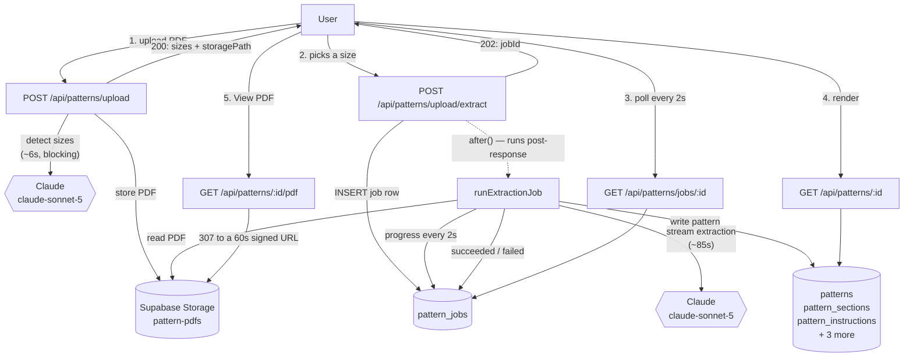
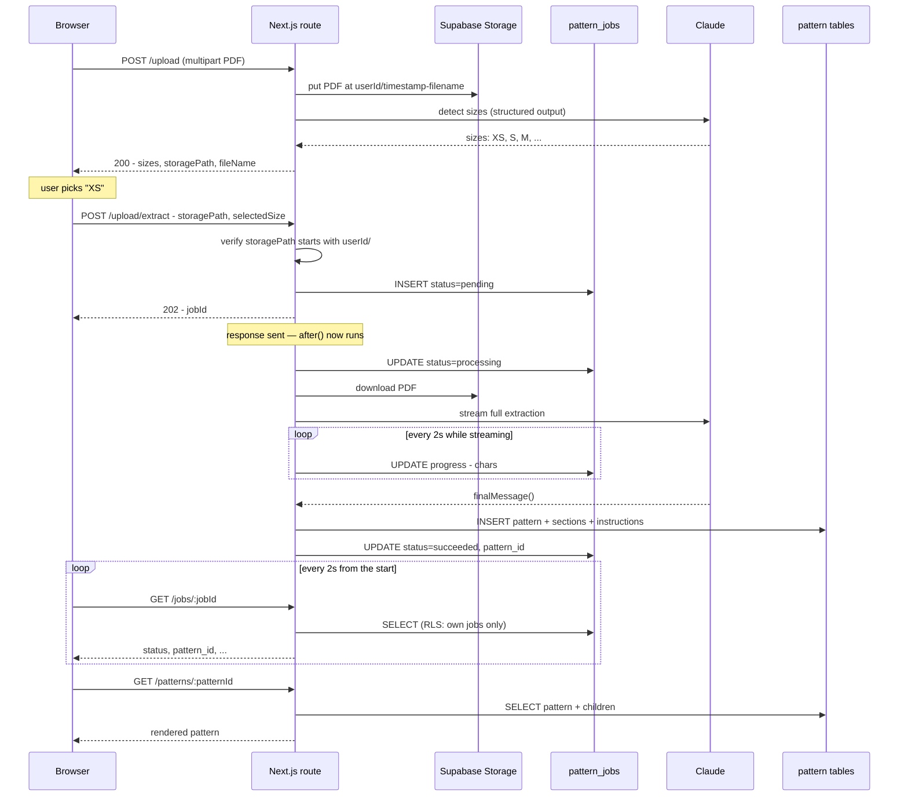
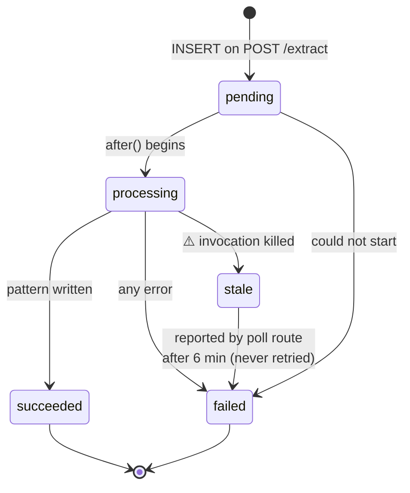

# Pattern Upload & Extraction

How a knitting pattern PDF becomes structured, renderable data — and where every
byte of it ends up.

> **Status.** This describes `main` as it runs today. Verified against
> `app/api/patterns/upload/`, `lib/patterns/extract-job.ts`, and
> `lib/upload/UploadContext.tsx` on 2026-09-12. Anything marked ⚠️ is a known
> limitation, not a description of intended behaviour.

---

## TL;DR

Upload is **two API calls, not one**, because the user picks a size in between.

1. **Phase 1** — PDF is stored, and Claude is asked *only* which sizes the pattern offers. Fast (~6s).
2. **The user picks a size.**
3. **Phase 2** — Claude extracts the full pattern, collapsed to that one size. Slow (~85s), so it runs in the background and the client polls.

Extraction is done entirely by Claude. There is no PDF text-extraction library in
this project — the PDF bytes go straight to the model.

The PDF itself lives in Supabase Storage; the structured result is fanned out
across seven Postgres tables. See [Where everything is stored](#where-everything-is-stored).

---

## Architecture



Two things to notice:

- **`after()` is not a queue.** It defers a callback until after the response is
  flushed, in the *same* serverless invocation. There is no broker and no
  worker pool.
- **Streaming stops at the backend.** The Claude call is streamed
  (backend ↔ Claude), but the browser learns about progress by *polling*.
  Nothing is streamed to the browser.

---

## Sequence — the happy path



---

## Job state machine



`stale` is not a stored value. If a row sits in `pending`/`processing` past
`STALE_AFTER_MS` (6 minutes), the poll route *reports* it as `failed` so the UI
can't spin forever. ⚠️ **The work is lost, not retried.**

A job is also guarded against running twice: `runExtractionJob` re-reads the row
and returns early unless it is still `pending`.

---

## Where everything is stored

Four different places hold a piece of an uploaded pattern. They have different
lifetimes and different access rules.

### 1. The PDF — Supabase Storage

| | |
|---|---|
| Bucket | `pattern-pdfs` |
| Path | `{user.id}/{Date.now()}-{originalFileName}` |
| Written by | `POST /api/patterns/upload` (phase 1), with the caller's own session |
| Read by | the background worker, via the **service-role** client |
| Read by users | `GET /api/patterns/[id]/pdf`, which signs the path for 60s |
| Bucket visibility | **private** |
| `file_size_limit` | none |
| `allowed_mime_types` | none (the route checks `file.type === 'application/pdf'` itself) |

The user-id prefix is load-bearing. Phase 2 verifies that `storagePath` starts
with `${user.id}/` before queueing any work, because the worker runs with the
service-role key and bypasses RLS — **that check is the only place ownership is
enforced** on the background path.

RLS policies on `storage.objects` scope both insert and select to the caller's
own folder:

```sql
(bucket_id = 'pattern-pdfs') AND (auth.uid()::text = (storage.foldername(name))[1])
```

### Why reads go through a route

The bucket used to be **public**, which meant those policies were decorative:
a public bucket serves `/storage/v1/object/public/pattern-pdfs/<path>` without
authentication and never consults RLS. The public URL was persisted to
`patterns.pdf_url` and rendered as a plain link, so **the URL was the
permission** — permanently valid, and readable by anyone who came to hold it.
For files that are largely purchased, copyrighted patterns, that was the wrong
default.

Now the bucket is private and `GET /api/patterns/[id]/pdf` is the only way in.
It checks the session, confirms the row belongs to the caller, and 307-redirects
to a signed URL with a 60-second TTL. Signing runs on the caller's own Supabase
client rather than the service-role one, so the owner-scoped policy above
applies too — ownership is enforced twice on purpose.

A leaked link is now bounded: the redirect target dies in a minute, and the
route URL itself is useless to anyone not signed in as the owner.

### 2. The pattern — Postgres, seven tables

The extracted JSON is decomposed on write by `persistPattern`. Nothing stores
the whole shape as-is except `pattern_details.raw_extraction`, which keeps the
complete Claude response as JSONB — the escape hatch for when a field turns out
to have been dropped on the floor.

| Table | Holds | Key columns |
|---|---|---|
| `patterns` | The pattern itself, one row | `name`, `designer`, `difficulty`, `pattern_type`, `selected_size`, `storage_path`, `pdf_filename` |
| `pattern_details` | One row of metadata | `gauge_stitches`, `gauge_rows`, `gauge_needle_size`, `needles`, `notions`, `finished_measurements`, `construction_method`, **`raw_extraction`** |
| `pattern_materials` | Yarn requirements, one row per yarn | `yarn_weight`, `yarn_name`, `yarn_brand`, `yardage_needed`, `grams_needed`, `skeins_needed`, `color_name` |
| `pattern_sections` | Sections, ordered | `section_name`, `section_order`, `section_type`, `content`, `applicable_sizes` |
| `pattern_instructions` | Rows/steps, FK to a section | `step_number`, `instruction_text`, `row_start`, `row_end`, `is_repeat`, `size_variations` |
| `pattern_stitch_glossary` | Abbreviations | `abbreviation`, `name`, `description`, `stitch_count_change`, `category` |
| `pattern_jobs` | Bookkeeping only — **no pattern data** | `status`, `storage_path`, `file_name`, `selected_size`, `pattern_id`, `error`, `warnings`, `progress` |

`patterns.storage_path` holds the object's path inside the bucket — a location,
not a credential. `patterns.pdf_url` is the legacy column that held the public
URL; it is no longer written and no longer resolves, but it is kept (dropping a
column is not additive) and `storagePathForPattern()` in
`lib/patterns/storage-path.ts` still parses a path out of it so rows predating
the column keep working.

**Section content is polymorphic.** `pattern_sections.section_type` is the
discriminator: `written_instructions` sections put their rows in
`pattern_instructions`; `chart`, `stitch_pattern`, `schematic`, and `notes`
store JSONB in `pattern_sections.content` and write no instruction rows. The
TypeScript types mirror this as a discriminated union.

**Writes are partially tolerant.** Only the `patterns` insert is fatal. If
details, materials, glossary, or sections fail, the error is pushed onto a
`warnings` array, saved on the job row, and the job still reports `succeeded`.
A pattern can therefore exist with pieces missing — check `pattern_jobs.warnings`.

⚠️ **The `patterns` row does not exist until extraction succeeds.** There is no
`status` column on `patterns` — status lives on the job. So there is no stable
pattern id to deep-link to while work is in flight.

All of these tables are user-scoped with RLS on `auth.uid() = user_id`.
`pattern_jobs` grants users **select only**; every write to it comes from the
worker's service-role client.

### 3. The in-flight job id — browser `localStorage`

Key `yarnstash:active-extraction-job.v1`, holding `{ jobId, fileName, selectedSize }`.

Written when phase 2 returns its `202`, cleared when the job reaches a terminal
state or the user dismisses the status bar. On mount, `UploadContext` reads it
and resumes polling — which is why a refresh mid-extraction rejoins the running
job instead of orphaning it.

### 4. What deletion actually removes

`DELETE /api/patterns/[id]` resolves the object via `storagePathForPattern()`,
removes it from `pattern-pdfs`, then deletes the pattern row; the child tables
follow by FK cascade. The `pattern_jobs` row is **not** deleted — its
`pattern_id` FK is `ON DELETE SET NULL`, so job history survives with a null
pattern reference.

---

## The Claude calls

Both phases use `claude-sonnet-5` with **thinking explicitly disabled**, because
thinking shares the `max_tokens` budget and neither call reads it.

| | Phase 1 (sizes) | Phase 2 (extraction) |
|---|---|---|
| Lives in | `app/api/patterns/upload/route.ts` | `lib/patterns/extract-job.ts` |
| `maxDuration` | 60s | 300s (on the extract route) |
| `max_tokens` | 1,024 | 96,000 |
| Streamed | No | **Yes** |
| Output shape | `output_config` JSON schema | Prompt-constrained raw JSON |
| Typical duration | ~6s | ~85s |
| On failure | Falls back to `[]`; upload still succeeds | Job → `failed` |

Three constraints that are easy to reintroduce by accident:

1. **No assistant prefill.** Ending `messages` with
   `{role:'assistant', content:'{'}` returns **400** — current models reject it.
   Phase 1 uses structured outputs instead; phase 2 relies on its system prompt.
2. **Never index `content[0]`.** Find the text block by type. With thinking on,
   the first block is a thinking block.
3. **Pin the model in one place.** `claude-sonnet-4-20250514` was retired and
   started returning 404, which broke upload outright. Each route keeps the id
   in a single named constant.

### Size filtering is the whole point of phase 1

`buildExtractionPrompt(selectedSize)` injects an instruction telling Claude to
collapse multi-size notation down to the chosen size:

> Wherever the pattern lists values for multiple sizes — often in parenthetical
> format like `55 (56) 58 (59) 61 (62)` or comma-separated like
> `120 (132, 144, 156, 168)` — extract ONLY the value for size `XS`.

That is why upload is two calls. Without a size, every measurement in the
extracted pattern would be ambiguous.

If size detection returns an empty array — a one-size pattern, or a failed parse
— the UI skips the picker and goes straight to extraction with
`selectedSize: null`.

---

## Failure modes

| Scenario | Behaviour |
|---|---|
| Not signed in | `401` |
| Not a PDF | `400` |
| `storagePath` not owned by caller | `403` |
| Size detection returns bad JSON | Degrades to `[]` — no size picker, full extraction |
| Job insert fails (table missing) | `500`, no `jobId` |
| Claude API error | Job → `failed`, message surfaced |
| Response hits `max_tokens` | Job → `failed` (**not** silently truncated) |
| Empty response | Job → `failed` |
| Child-table insert fails | Job → `succeeded` **with `warnings`**; pattern is incomplete |
| Invocation killed mid-run | Reported `failed` after 6 min. ⚠️ Not retried. |
| Extraction exceeds 300s | Killed by `maxDuration`. ⚠️ Not retried. |
| Poll fails 10× consecutively | Client gives up and tells the user to reload |
| PDF requested by a non-owner | `404` from `/api/patterns/[id]/pdf` — not `403`, which would confirm the id exists |
| Signed URL followed after 60s | Supabase rejects it; clicking "View PDF" again mints a fresh one |
| ⚠️ File too large | **No limit is enforced** — not in the route, not on the bucket |

---

## Known limitations

⚠️ These are real and current:

1. **No retry.** `after()` gives no redelivery. Interrupted work is detected and
   reported, never re-run. A real queue would redeliver.
2. **300-second ceiling.** Extraction runs inside the request's `maxDuration`
   budget. A pattern needing longer is killed. Streaming protects against dying
   *early* from an idle connection; it does not raise this ceiling.
3. **`progress` is written but never read.** The backend records `{chars: N}`
   every 2s and the API returns it — no UI consumes it. A progress bar is
   plumbing away, not built.
4. **No upload size limit.** Neither the route nor the bucket caps file size, so
   an oversized PDF fails late — as a base64 blob against the model's limits —
   rather than fast, as a `413`.
5. **No OCR.** Image-only or scanned PDFs will extract poorly or not at all.
6. **Orphaned PDFs.** A failed extraction leaves its PDF in the bucket forever;
   nothing sweeps storage for objects with no surviving pattern row.

Limitations listed in earlier revisions of this doc that have since been fixed:
a React double-invoke could queue the same extraction twice (`selectSize` now
reads state outside the updater and guards on status); `runExtractionJob` now
refuses to run a job that is not still `pending`; and uploaded PDFs were
world-readable by URL (the bucket is private and reads are signed — see
[Why reads go through a route](#why-reads-go-through-a-route)).

---

## Running it locally

```sh
npm run dev
```

Requires `ANTHROPIC_API_KEY`, `NEXT_PUBLIC_SUPABASE_URL`,
`NEXT_PUBLIC_SUPABASE_PUBLISHABLE_KEY`, and — for the background worker —
`SUPABASE_SERVICE_ROLE_KEY` in `.env.local`.

`pattern_jobs` and the `pattern-pdfs` bucket must both exist, the bucket must be
**private**, and `patterns.storage_path` must exist. Recreating this elsewhere is
not currently possible from this repo alone: only `010_pattern_jobs.sql` and
`20260912185927_patterns_storage_path.sql` are captured in
`supabase/migrations/`, and the storage bucket was created through the dashboard
and is described nowhere in source. See `supabase/README.md`.

⚠️ **Ordering matters when deploying this.** `persistPattern` writes
`storage_path` unconditionally, so the migration has to land *before* the code —
otherwise every extraction fails at the insert with "column does not exist". The
bucket flip and the code should also ship together: flipping first breaks the
existing "View PDF" links until the new route exists, and shipping first leaves
the code signing URLs in a bucket that is still public.

Useful log lines during an upload:

```
Extracted sizes: [ 'XS', 'S', 'M', ... ]     phase 1 succeeded
Extraction parsed (size: XS): 12 sections    phase 2 parsed
Pattern "..." saved (size: XS)               phase 2 persisted
```

A job that fails logs with its id: `[job <uuid>] extraction failed: ...`.
